## Analiza Wymagań

**Wymagania funkcjonalne:**

### System umożliwia:
- rejestrację użytkowników
- autentykację użytkowników
- manipulacje danymi produktów
- zarządzanie promocjami
- kupno produktu oraz ewentualną reklamację po zakupie
- opublikowanie opinii o usługach sklepu
- kontakt ze sprzedawcą za pomocą formularza

**Wymagania niefunkcjonalne:**
- Stabilność systemu - SLA - Uptime - System ma byc w stanie dzialac poprawnie przez 99% czasu,
- Odporność na błędy - błędy/godzine, ktore sprawia, ze system bedzie w nieprawidlowym stanie
- Przenośność kodu - Techonologie powinny byc dobierane z mysla, o tym, ze serwer moze miec rozne architektury, metryka : Ilosc architektur procesorow zdolna do uruchomienia programu
- Czystość kodu - Cyclomatic complexity  < 11
- Jakość kodu - Zachowany proces PR, podejscie funkcyjne, metryka: ilosc plikow o > 1k loc
- Optymalizacja - sredni czas przetwarzania requestu < 1s

**Use cases:**

Rejestr zamówień:

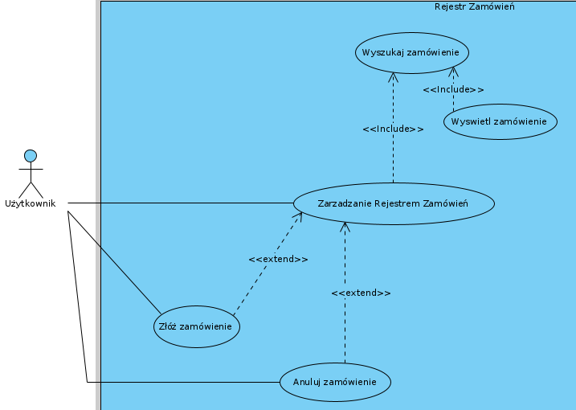

Rejestr produktów:

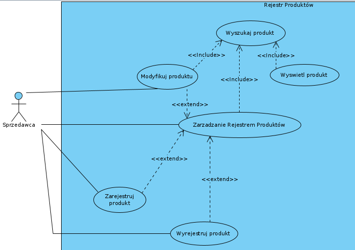

Diagramy klas: 

TODO_GDY_KOD_BEDZIE_GOTOWY

Diagramy komponentów: 

Diagramy sekwencji:

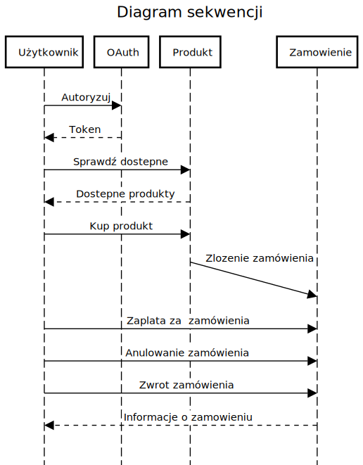

Struktura danych: 

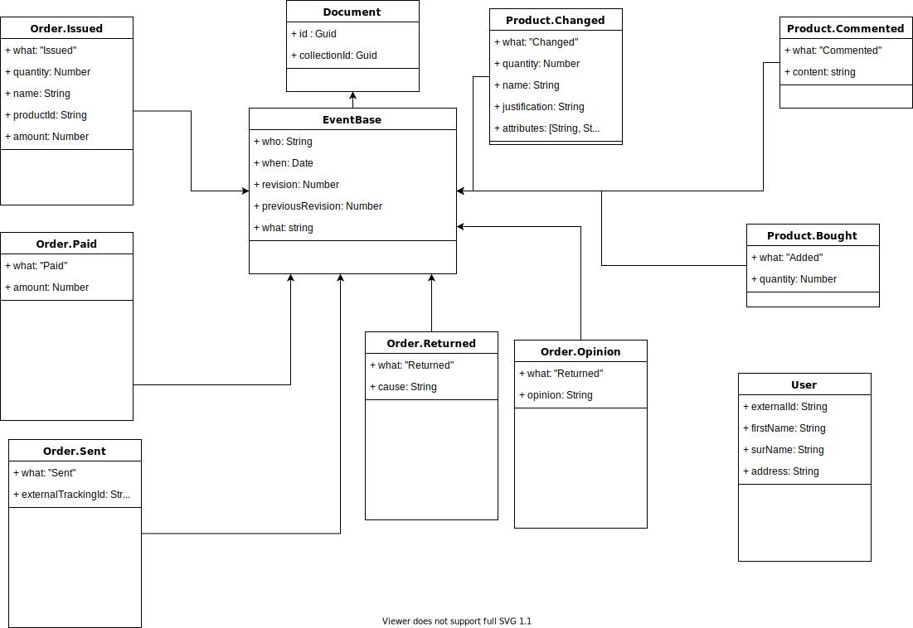

**Planowane Testy:**
Funkcjonalne

**Przypadki testowe:**
GDY: poprawne dane autentykacji || AKCJA:autentykacja || REZULTAT:użytkownik zalogowany  
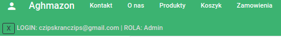
GDY: niepoprawne dane autentykacji || AKCJA:autentykacja || REZULTAT:użytkownik niezalogowany
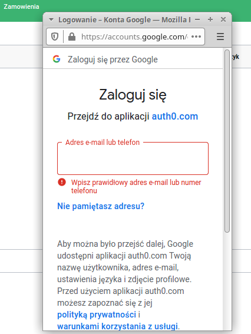  

GDY:użytkownik niezalogowany || AKCJA:pobranie listy produktów || REZULTAT:brak możliwości wyświetlenia produktów  
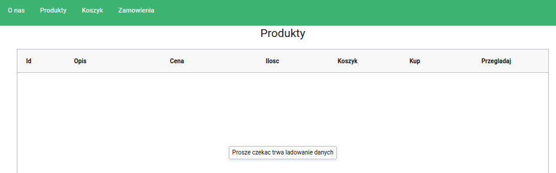
GDY:użytkownik zalogowany || AKCJA:pobranie listy produktów || REZULTAT:wyświetlenie produktów
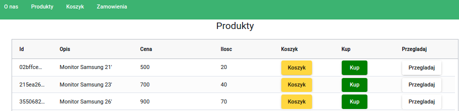
  

GDY:użytkownik zalogowany, produkty w systemie || AKCJA:dodanie produktów do koszyka || REZULTAT:produkty w koszyku
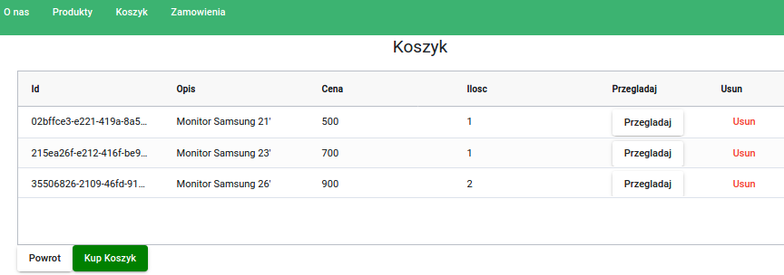  
GDY:użytkownik zalogowany, produkty w koszyku || AKCJA:usunięcie produktów z koszyka || REZULTAT:usunięcie produktów z koszyka
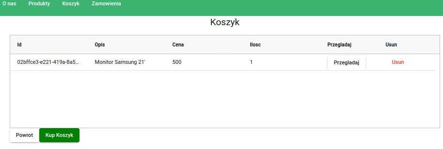
  

GDY:użytkownik zalogowany, prawidlowe dane karty bankowej || AKCJA:zaakceptowanie płatności || REZULTAT:zmiana statusu na 'zaakceptowano platnosc'
  
GDY:użytkownik zalogowany, nieprawidlowe dane karty bankowej || AKCJA:zaakceptowanie płatności || REZULTAT:brak zmiany statusu płatnosci
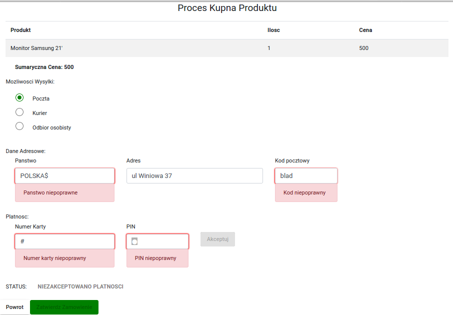  

GDY:użytkownik zalogowany, prawidłowe dane karty bankowej, prawidłowe dane adresowe || AKCJA:wprowadzenie danych || REZULTAT:możliwość zatwierdzenia zamówienia
  
GDY:użytkownik zalogowany, nieprawidłowe dane karty bankowej, nieprawidłowe dane adresowe || AKCJA:wprowadzenie danych || REZULTAT:brak możliwości zatwierdzenia zamówienia

  

GDY:użytkownik zalogowany, zatwierdzenie zamówienia || AKCJA:zatwierdzenie zamówienia || REZULTAT:utworzenie zamówienia, zapłacenie, utrwalenie danych adresowych
  

GDY:użytkownik zalogowany, zamówienie w systemie || AKCJA:reklamacja zamówienia || REZULTAT:zamówienie w stanie 'Zareklamowany'
  

GDY:administator zalogowany, poprawne dane produktu || AKCJA:utworzenie nowego produktu || REZULTAT:nowy produkt w systemie
  
GDY:administator zalogowany, niepoprawne dane produktu || AKCJA:utworzenie nowego produktu || REZULTAT:brak możliwości utworzenia produkt w systemie
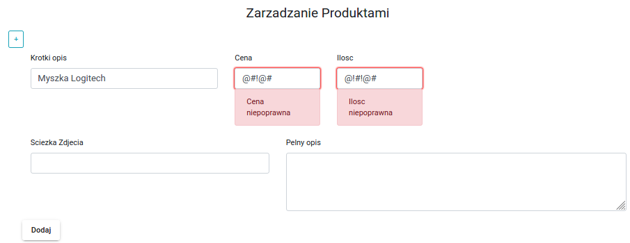

GDY:administator zalogowany, zamówienie w stanie 'Zapłacony' || AKCJA:Wyślij || REZULTAT:zmiana statusu na 'Wysłano'  
GDY:administator zalogowany, zamówienie w stanie innym niż 'Zapłacony' || AKCJA:Wyślij || REZULTAT:niemożliwość zmiany statusu
  

GDY:administator zalogowany, zamówienie w stanie 'Zareklamowany' || AKCJA:Zwrot || REZULTAT:zmiana statusu na 'Zwrócony'  
GDY:administator zalogowany, zamówienie w stanie innym niż 'Zareklamowany' || AKCJA:Zwrot || REZULTAT:niemożliwość zmiana statusu na 'Zwrócony'  

**Opis przeprowadzonych Testów:**
Przeprowadzone zostały testy funkcjonalne dowodzące temu że aplikacja zachowuje się prawidłowo, jak oczekiwano. Operacje wywoływane przez warstwę interfejsu użytkownika zmieniają stan encji na bazie danych, dane przechodzą z jednego walidnego stanu w drugi zgodnie z założeniami. Operacje zmiany stanu są odpowiednio chronione, dostep mają do nich tylko użytkownicy, którzy przeszli prawidłowo proces autentykacji. Zastosowana walidacja pól formularza na warstwie UI, spełnia założenia - zapobiega wprowadzaniu nieprawidłowych danych.

