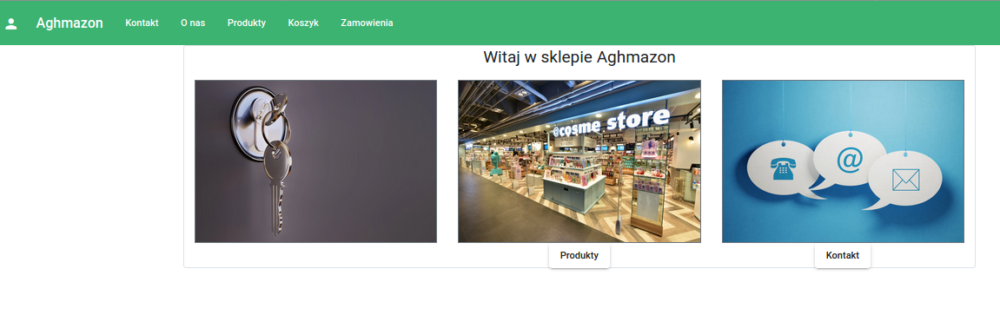

## Instrukcja Użytkownika

**Rola Użytkownik:**  

  
Ekran główny,  
Z ekranu głównego możemy przejść na strony takie jak: Zaloguj, O nas, Kontakt, Produkty, Zamówienia

  
Autentykacja,  
W celu autentykacji klikamy na ikonę osoby w prawym górnym rogu następnie logujemy się (za pomocą Oauth) wprowadzając dane użytkownika 

  
Po prawidłowym zalogowaniu się, możemy otworzyć panel z informacją o użytkowniku i jego roli w systemie

  
Produkty,  
Po wejsciu na stronę produkty, widzimy wszystkie produkty, które są na magazynie wraz z detalami jak cena, nazwa  
Mozliwe akcje to: Kupno, Dodanie do koszyka, Przegląd produktu

  
Przegląd produktu,  
W celu zapoznania się z ofertą, dokładnym opisem oraz zdjęciem produktu należy kliknąć 'Przegląd' 

  
Koszyk,  
Funkcjonalność koszyka zapewnia nam możliwość kupienia wielu produktów w jednym zamówieniu.

  
Proces Kupna Produktu,  
Na etapie kupna produktu wybieramy rodzaj wysyłki, adres kupującego oraz jesteśmy zobligowani do podania numerów karty bankowej, następnie akcpetujemy daną tranzakcje

  
Po prawidłowym zwalidowaniu danych karty bankowej, status zmienia się na 'Zaakceptowano płatność', przycisk 'Zatwierdź zamówienie' zostaje odblokowany, po jego naciśnięciu tranzakcja kupna produktów zostaje sfinalizowana - dokonujemy płatności, dane adresowe zostają utrwalone w systemie

  
Zamówienia
W sekcji zamówienia mamy dane o swoich dotychczasowych realizacjach zamówień, każdy produkt możemy dodatkowo przeglądnąć, mamy również możliwość zareklamowania zamówienia

  
Reklamacja,  
W sekcji reklamacja mamy możliwość zareklamować zamówienie wpisując przyczyne reklamacji

**Rola Administrator:**

  
Zarządzanie Produktami,  
W tej skekcji, mamy możliwość dodania nowego produktu do systemu

  
Zarządzanie Zamówieniami,  
W tej skekcji, mamy możliwość wysłania lub przyjecia reklamacji konkretnego zamówienia