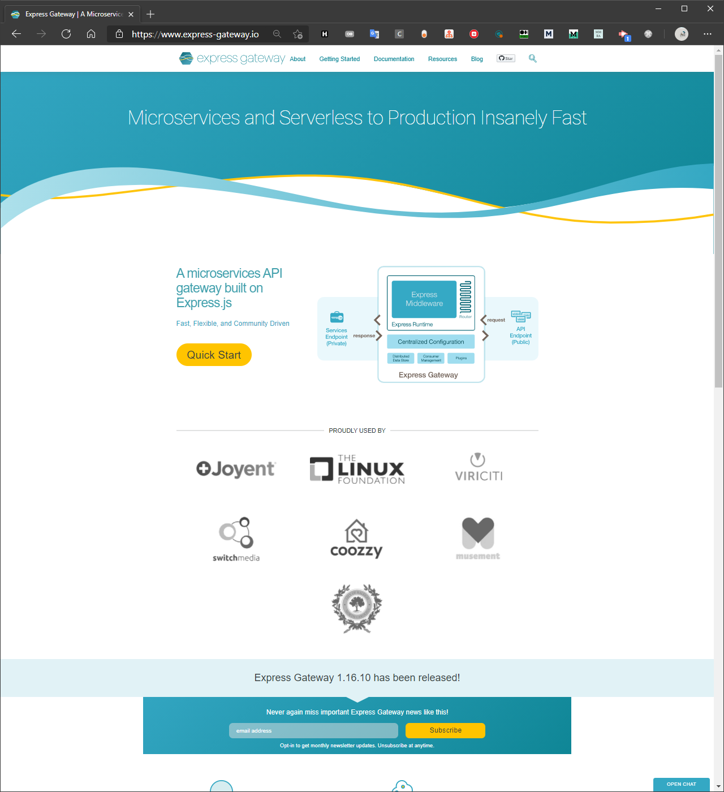
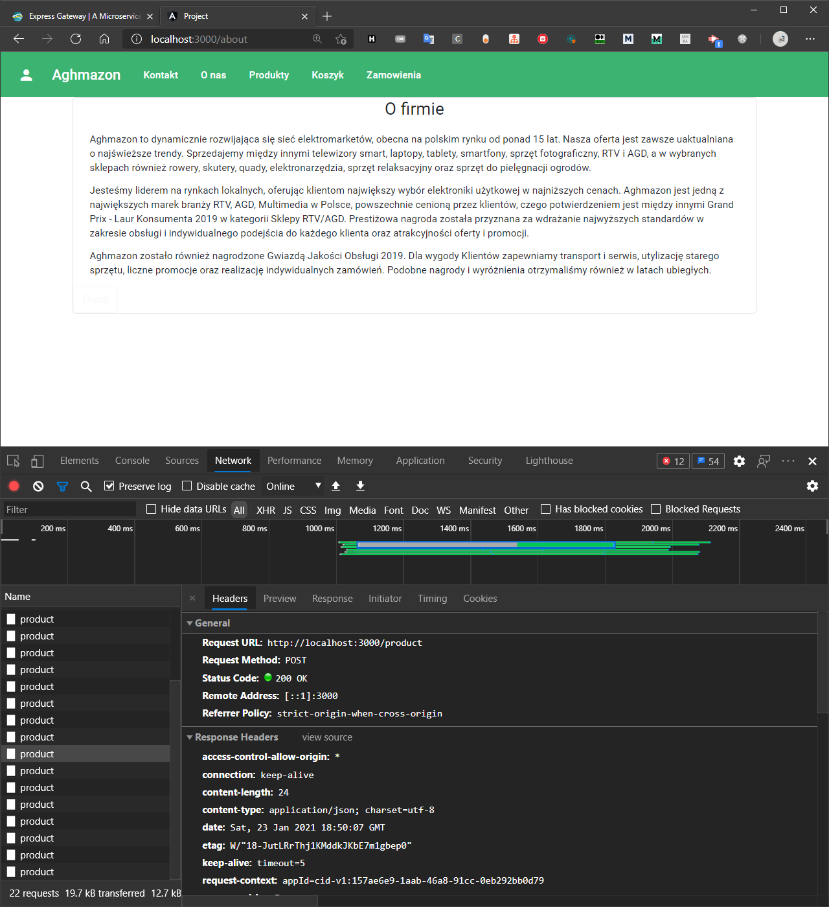
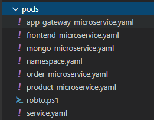
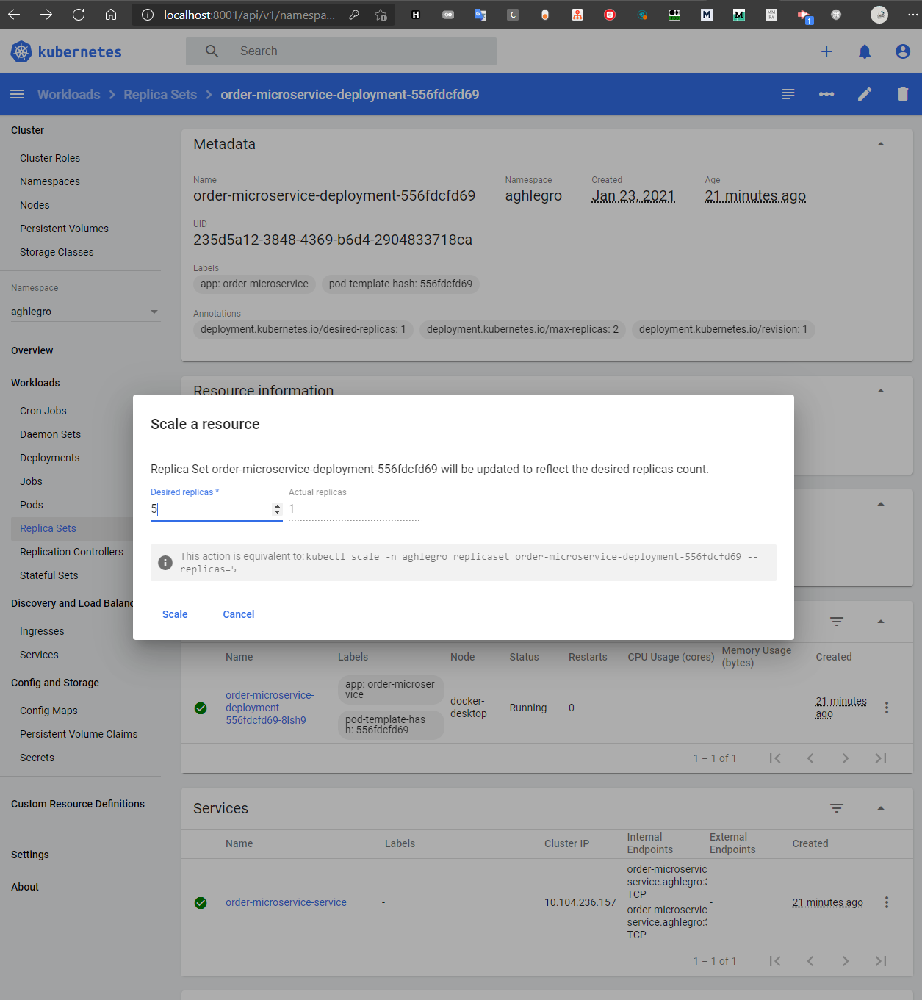
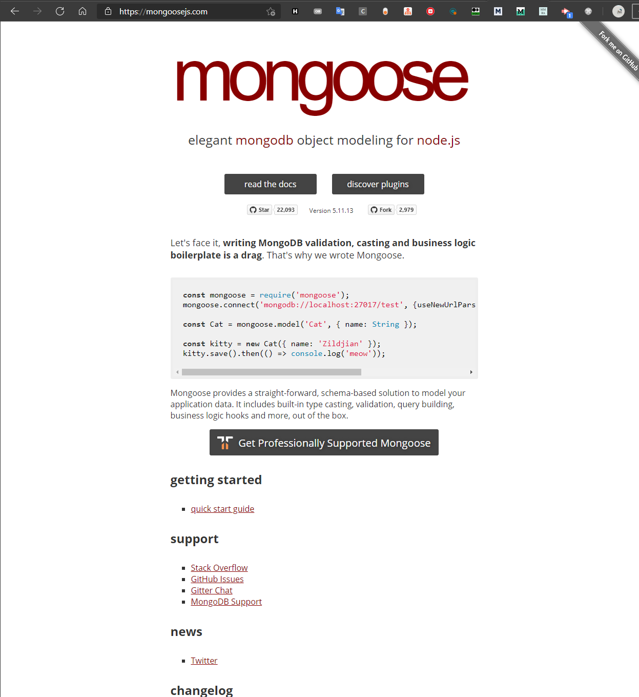
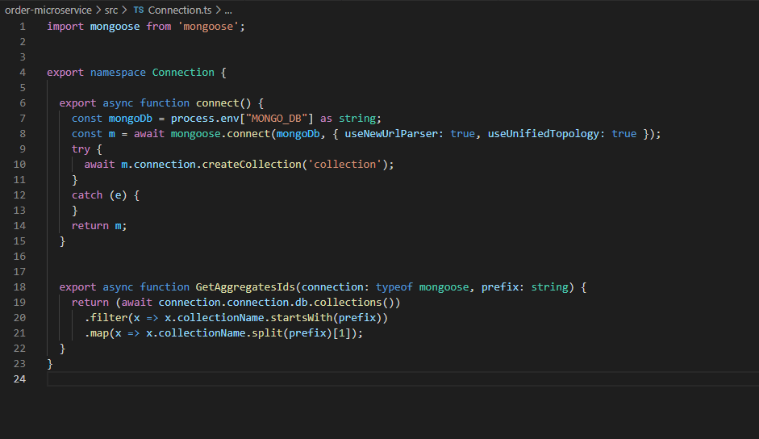
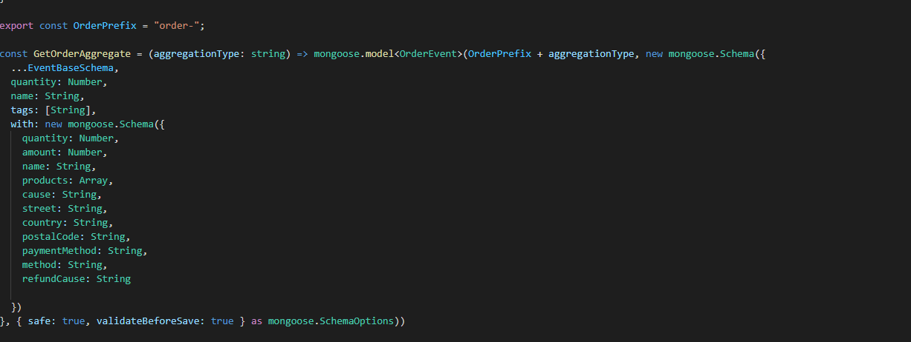
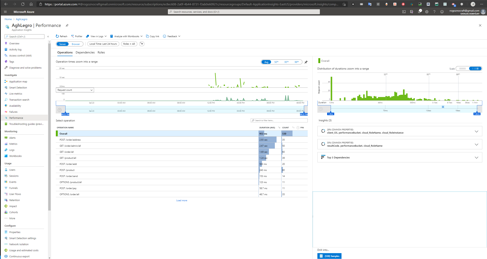

- [Opis technologi](#opis-technologi)
  - [Autoryzacja użytkownika - Auth0](#autoryzacja-użytkownika---auth0)
      - [Panel z rolami](#panel-z-rolami)
      - [Wybór ról do dodania](#wybór-ról-do-dodania)
  - [Router do requestów - Application Gateway](#router-do-requestów---application-gateway)
      - [Screen strony głównej projektu](#screen-strony-głównej-projektu)
      - [Konfiguracja ścieżek (/app-gateway-microservice)](#konfiguracja-ścieżek-app-gateway-microservice)
      - [Request aplikacji pod adres http://localhost:3000/product został przeproxowany do product-microservice, przez co wybastrakcjonowane zostały zależności i nie musimy konfigurować CORS-a](#request-aplikacji-pod-adres-httplocalhost3000product-został-przeproxowany-do-product-microservice-przez-co-wybastrakcjonowane-zostały-zależności-i-nie-musimy-konfigurować-cors-a)
  - [Warstwa łącząca mikroserwisy - swagger](#warstwa-łącząca-mikroserwisy---swagger)
        - [Swagger-ui pozwala na testowanie aplikacji poprzez udostępnienie UI dla metod restowych, które jest generowane na podstawie kodu aplikacji](#swagger-ui-pozwala-na-testowanie-aplikacji-poprzez-udostępnienie-ui-dla-metod-restowych-które-jest-generowane-na-podstawie-kodu-aplikacji)
        - [Konfiguracja swaggera znajdującego się w `commons-microservice` dołączanego do każdego z naszych mikroserwisów node - pozwala to wszystkim mikroserwisom łatwo udostępnić swagger-ui](#konfiguracja-swaggera-znajdującego-się-w-commons-microservice-dołączanego-do-każdego-z-naszych-mikroserwisów-node---pozwala-to-wszystkim-mikroserwisom-łatwo-udostępnić-swagger-ui)
  - [Narzędzie do rekompilacji - nodemon](#narzędzie-do-rekompilacji---nodemon)
      - [Przykładowa konfiguracja nodemon odpowiadająca powyższemu pipeline](#przykładowa-konfiguracja-nodemon-odpowiadająca-powyższemu-pipeline)
      - [NodeMon automatycznie nasłuchujący na zmianę plików żródłowych i przeładujący aplikację](#nodemon-automatycznie-nasłuchujący-na-zmianę-plików-żródłowych-i-przeładujący-aplikację)
  - [Docker](#docker)
      - [Dockerfile dla BE](#dockerfile-dla-be)
      - [Dockerfile dla Angulara](#dockerfile-dla-angulara)

## Opis technologi

### Autoryzacja użytkownika - Auth0

Jako, że domyślnie auth0 nie przekazuje ról dodana została `reguła` - jest to fragment kodu w auth0, który pozwala na wykonanie akcji podczas pozyskiwaniu tokenu usera na serwerach auth 0`

```javascript
function setRolesToUser(user, context, callback) {
  context.idToken['https://any-namespace/roles'] = context.authorization.roles;
  context.accessToken['https://any-namespace/roles'] = context.authorization.roles;
  callback(null, user, context);
}
```

Ta funkcja wystawia jako `https://any-namespace/roles` role dodane w interfejsie Auth0 - są one kopiowane do tokena.


##### Panel z rolami


##### Wybór ról do dodania

### Router do requestów - Application Gateway

Gdy mamy aplikację mikroserwisową w celu zmiejszenia poziomu zależności użyty został API Gateway pattern - polega on na ukryciu faktu, że tak na prawdę zamiast do jednego serwisu robimy zapytania do wielu mikroserwisów.

Z jednej strony mamy możliwość śledzenia wszystkich zapytań, które aplikacja wykonuje, z drugiej możemy podmieniać mikroserwisy, ścieżki do nich i adresy do mikroserwisów w prosty sposób, ponieważ w mikroserwisach wykorzystujemy tylko adres application gatewaya.

W tym celu napisaliśmy aplikację node z użyciem biblioteki `Express gateway`


##### Screen strony głównej projektu


##### Konfiguracja ścieżek (/app-gateway-microservice)


Pozwoliło nam to podzielić aplikację na 3 części

1. Frontendową - routowaną gdy żadna inna ścieżka nie pasuje
2. Order-Microservice - api mikroserwisu zamówień
3. Product-Microservice - api mikroserwisu produktu
4. Swagger - proxy do endpointu z dokumentacją

Osiągneliśmy dzięki temu możliwość przyszłej rozbudowy, podziału ścieżek w mikroserwisach na różne mikroserwisy bez łamania wstecznej kompatybilności


##### Request aplikacji pod adres http://localhost:3000/product został przeproxowany do product-microservice, przez co wybastrakcjonowane zostały zależności i nie musimy konfigurować CORS-a

### Warstwa intefejsu użytkownika - Angular

Angular jest wszechstronnym narzędziem do tworzenia i kontrolowania widoków stron aplikacji na warstwie frontend  
Pozwala miedzy innymi na:
- komunikacje miedzy komponentami
- wsparcie dla wykonywania wywołań asynchronicznych
- wstrzykiwanie zależności reużywalnych serwisów
- obsługe ciasteczek(cookies)
- routing
- stylowanie (kompatybilny z bootstrap)

Świetnie współpracuje z jezykiem skryptowym Typescript, który jest rozszerzeniem jezyka Javascript 

### Warstwa łącząca mikroserwisy - swagger

Jako, że rest-api nie posiada żadnego standardowego mechanizmu dokumentacji endpointów zastosowaliśmy
- swagger
- swagger-ui
- tsoa - biblioteka do typescript pozwalająca na generowanie pliku swaggera z kontrolerów
- openapi-generator-cli - narzędzie pozwalające generować klienta do api, żeby nie musieć pisać ich ręcznie

Które pozwoliły nam uporościć komunikację pomiędzy poszczególnymi mikroserwisami a także debugowanie i developowanie aplikacji


###### Swagger-ui pozwala na testowanie aplikacji poprzez udostępnienie UI dla metod restowych, które jest generowane na podstawie kodu aplikacji


###### Konfiguracja swaggera znajdującego się w `commons-microservice` dołączanego do każdego z naszych mikroserwisów node - pozwala to wszystkim mikroserwisom łatwo udostępnić swagger-ui

### Narzędzie do rekompilacji - nodemon

Domyślnie node nie ma narzędzi do wspomagania procesu developementu - po zmianie kodu należy zrestartować proces Node, co jest uciążliwe i prowadzi do błędów.

W naszym projekcie użyliśmy nodemon do 
- Przeładowania aplikacji gdy pliki src się zmienią
- Uruchomienie `tsoa` które generuje pliki `swagger` i automatyczną konfiguracje routów w Express.js
- Uruchomienie `openapi-generator-cli` generującego klienta do api po każdej zmianie, aby były zawsze aktualne


##### Przykładowa konfiguracja nodemon odpowiadająca powyższemu pipeline


##### NodeMon automatycznie nasłuchujący na zmianę plików żródłowych i przeładujący aplikację


### Docker

Docker jest standardem w konteneryzacji. Szczególnie gra dużą rolę w systemach rozproszonych, gdy musimy zamiast przewidywania wszystkich możliwych błędów skupić się na tym, żeby aplikacja mogła jak najszybciej i możliwe bezpiecznie przywrócić się do działania.

Aby takie podejście bylo możliwe nasza aplikacja musi być samowystarczalna - do tego służy docker - jego idea "Environment as a code" obiecuje nam, że będziemy w stanie odtworzyć naszą aplikację bez czasochłonnej konfiguracji sprzętu.

W naszej aplikacji mamy główny dockerfile zajmujący się budową wszystkich mikroserwisów, poprzez zbudowanie 'commonsów' a później aplikacji, ustawienie wspólnych zmiennych środowiskowych i wreszcie odpaleniem aplikacji serwerowej w jednolity sposób.

To podejście pozwoliło nam łatwo skonteneryzować wszystkie mikroserwisy back-endowe


##### Dockerfile dla BE


Jako, że na front-end mamy angulara nie mogliśmy użyć tego samego pliku, więc dla niego przygotowany został osobny


##### Dockerfile dla Angulara


### Kubernetes

Jest to narzędzie do orkiestrowania kontenerami, wykorzystujemy je do aplikacji topologii naszych serwisów - dzięki kubernetesowi mamy `Infrastructure as a code` - co jest poziomem wyżej nad ideą `environment as a code`. Dzięki temu możemy w kodzie zdefiniować 
- namespace (jest to prefix, który pomaga nam uporządkować logicznie komponenty)
- deploymenty (jest to pewien komponent grupujący)
- serwisy (abstrakcja nad grupą podów)
- zbiory replik (dostarczają narzędzia do pracy na replikach)
- pody (pojedyńcze instancje kontenerów)



##### Drzewo katalogu z konfiguracją kubernetsesa


##### Przykładowy kod deploymentu seriwisu zamówień

### Kubernetesss Dashboard

W naszych skryptach obecny jest także KubernetessDashboard - jest to aplikacja, która pozwala na łatwe zarządzanie klastrem przez gui WWW.

Aby uzyskać do niego dostęp na hoście musimy pobrać token


##### Pobieranie tokena na hoście


##### Ekran przedstawiający naszą aplikację, dostępne deploymenty, użyte obrazy i pody


##### Dzięki przystępnemu UI możemy skalować aplikację w locie

### Mongo

Mongo jest noSql bazą danych. Użyliśmy jej bo jest darmowa, dobrze komponuje się z Kubernetessem i pozwala na horyzontalne skalowanie. Biorąc pod uwagę konstrukcję naszej aplikacji (event sourcing / event log), jest to dla nas idealny wybór.

Mongo jest częścią naszej konfiguracji Deploymentów w kubernetesie, przez co jest tworzone razem z całą aplikacją po uruchomieniu skryptów.


##### Nasza konfiguracja mongo dla Kubernetessa

Do połączenia z naszą apką używamy mongose, który jest ODM (Object Domain Modeling library) i pozwala na łatwe korzystanie z obiektow JS oraz walidację ich


##### Strona główna projektu mongoose


##### Nasza konfiguracja połączenia


##### Przykładowa konfiguracja walidacji

### Application Insights

Jest to narzędzie stworzone przez microsoft do instrumentacji aplikacji. 
Używamy go do zbierania logów, monitorowania stanu aplikacji oraz błędów


##### Mapa aplikacji wygenerowana na podstawie zapytań http


##### Dashboard App-Insights przedstawiające sumaryzacje błędów, czasu odpowiedzi i żądań do serwisów


##### Dashboard przedstawiający błędy w aplikacji


##### Dashboard przedstawiający najmniej wydajne zapytania


##### Dashboard przedstawiający łańcuchy zależności (nie pojedyńcze zapytania), ktore wykonują się najdłużej


##### Dashboard przedstawiający logi w aplikacji

Jak widzimy, jest to kompleksowe narzędzie pozwalające na dogłębne monitorowanie aplikacji.

Konfiguracja jest jednak banalna.

W naszym bazowym mikroserwisie mamy kod konfiguracyjny


##### Kod konfiguracyjny BE

W angularze AI jest zainicjowane jako moduł


##### Inicjalizacja w angularze
