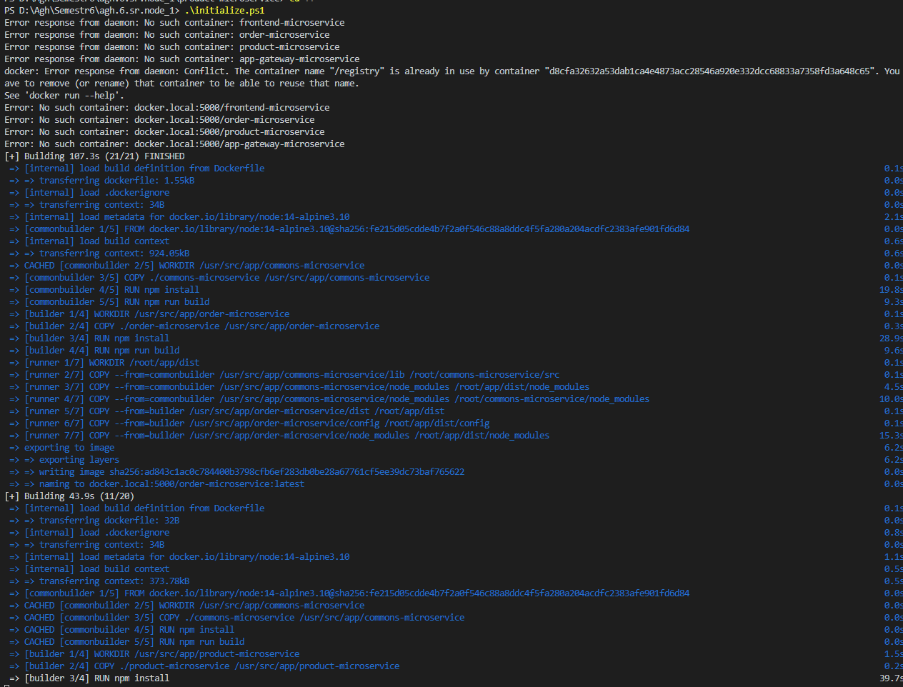
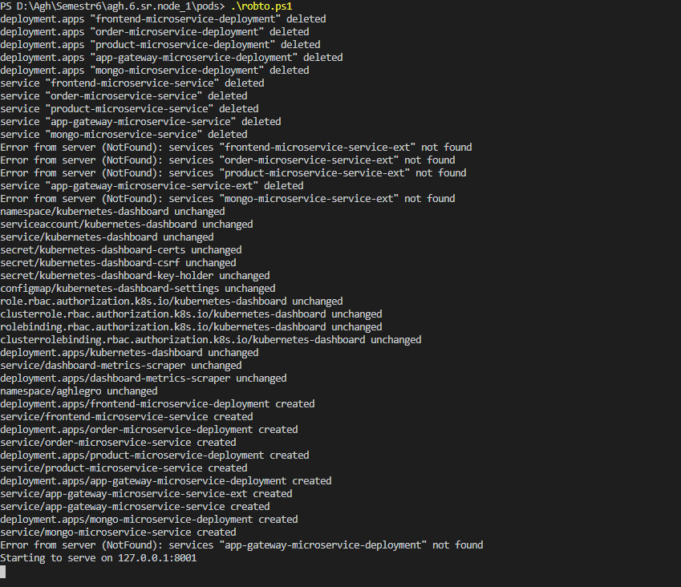
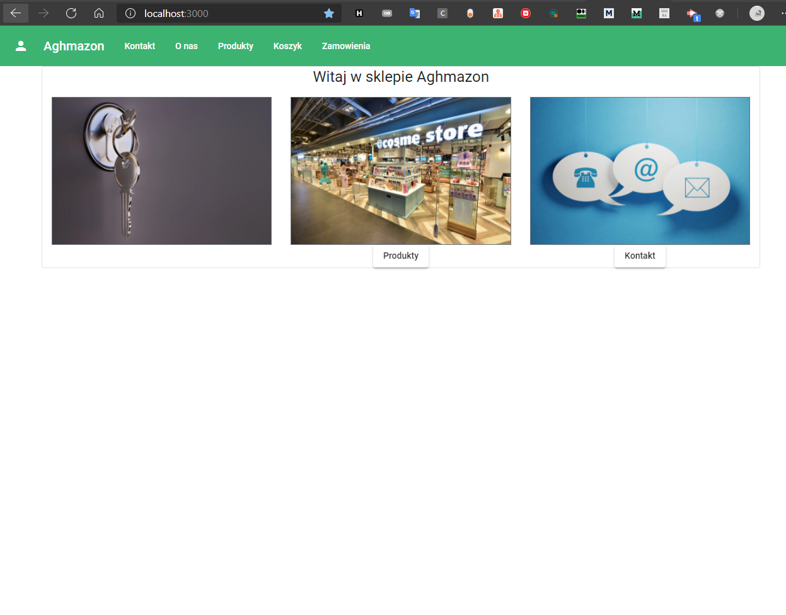

# SKLEP INTERNETOWY
autorzy: Mateusz Popielarz, Michał Flak, Kamil Gliński

[Koncepcja systemu](KONCEPCJA_SYSTEMU_ANALIZA_WYMAGAN.md)

[Analiza wymagan](ANALIZA_WYMAGAN.md)

[Opis technologin](OPIS_TECHNOLOGI.md)

[Instrukcja Uzytkownika](INSTRUKCJA_UZYTKOWNIKA.md)

## Opis uruchomienia

Uruchomienie było testowane tylko na windows.

1. WSL 2 [Instrukcja](https://docs.microsoft.com/en-us/windows/wsl/install-win10)
2. Docker for windows [Instrukcja](https://docs.docker.com/docker-for-windows/install/)
3. Kubernetess [Instrukcja](https://docs.docker.com/docker-for-windows/#kubernetes)
4. Stworzenie obrazów dockerowych (wywołanie Initialize.ps1)

##### Przykładowy log z uruchomienia

5. Stworzenie serwisów kubernetesss (wywołanie pods/robto.ps1)

##### Przykładowy log z uruchamiania

6. Aplikacja jest dostępna na http://localhost:3000
   
   