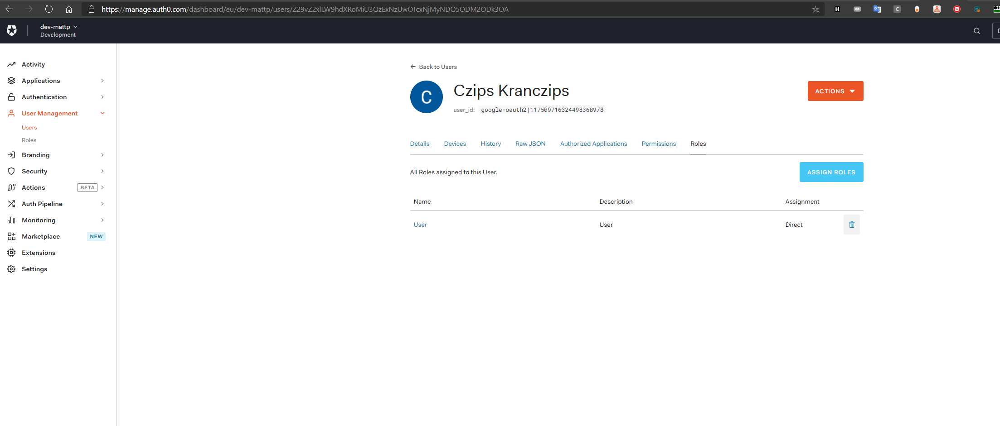
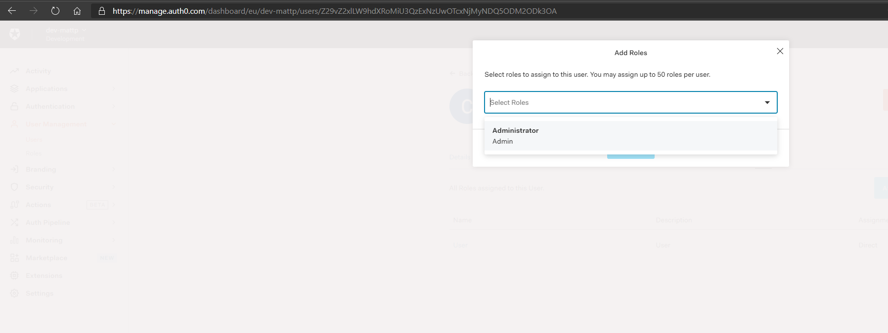

# SKLEP INTERNETOWY
autorzy: Mateusz Popielarz, Michał Flak, Kamil Gliński

[Koncepcja systemu](KONCEPCJA_SYSTEMU_ANALIZA_WYMAGAN.md)

[Analiza wymagan](ANALIZA_WYMAGAN.md)


## Auth0

Jako, że domyślnie auth0 nie przekazuje ról dodana została `reguła` - jest to fragment kodu w auth0, który pozwala na wykonanie akcji podczas pozyskiwaniu tokenu usera na serwerach auth 0`

```javascript
function setRolesToUser(user, context, callback) {
  context.idToken['https://any-namespace/roles'] = context.authorization.roles;
  context.accessToken['https://any-namespace/roles'] = context.authorization.roles;
  callback(null, user, context);
}
```

Ta funkcja wystawia jako `https://any-namespace/roles` role dodane w interfejsie Auth0 - są one kopiowane do tokena.


#### Panel z rolami




#### Wybór ról do dodania

