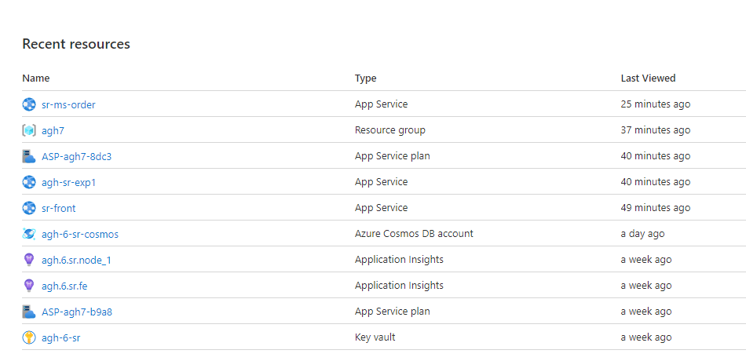

# Docker / Event Sourcing playground

My playground for getting better in Docker and EventSourcing pattern.

# Table of Contents


<br/>
<br/>

# Part 1. Set up

## Begining

At beginning i got idea to create each repository for each microservice. It seemed as good idea at first.
To get sure that it's not running only in my PC (as most software works on developer machine ;) ), so i got with azure for students


##### Free beer is always better
<br/>
So i went into azure and created couple of services 



> Why not Kubernetess orchestrator?

Well, its not free, and those linux 1GB app-services are ;)


# Part 2. Event Sourcing

My first attempt was to simply create something that works

```typescript
  @Get("hi")
  public async helloWorld(
  ): Promise<Product | null> {
    const mongoDb = process.env["MONGO_DB"] as string;
    mongoose.connect(mongoDb, { useNewUrlParser: true, useUnifiedTopology: true });
    await HelloWordAggregate.create({
      what: 'Bought',
      with: { quantity: 1 },
      when: new Date(),
      who: 'admin'
    });

    const helloTwo = await HelloWordAggregate.find({});
    const result = helloTwo.reduce(ProductReducer, product);
    return result;
  }
```

Here what i wanted do is simply save event, and read it in manner of

```typescript
export function ProductReducer(p: Product, event: ProductEvent) {
  switch (event.what) {
    case 'Bought':
      const quantityAfter = p.quantity - event.with.quantity;
      const result = { ...p, quantity: quantityAfter } as Product;
      return result;
      break;
    default:
      return product;
      break;
  }
}
```

To not keep final state of object, instead i wanted to construct it each time from scratch.

Of course, next thing i got on my mind was: 
> What would happen if i try to buy same thing from different instances of microservice? 

It stucked me, that this implementation offers nothing to help me deal with that kind of stuff.

> Maybe...  I just spin up one instance of microservice...

Not an option, i'm not doing those fancy, shinny eventSourcing stuff to be constrained at same way

Did some research and found great talk [Conflict Detection and Resolution in an Event-Sourced System](https://www.youtube.com/watch?v=-zaa6FUYIQM)

I got from there an idea - i should have sth like `revision` and `previous revision` on my event, to be able to distinct which events are conflicting, which are ok, and which are coliding, and when we have not actual event log state.


