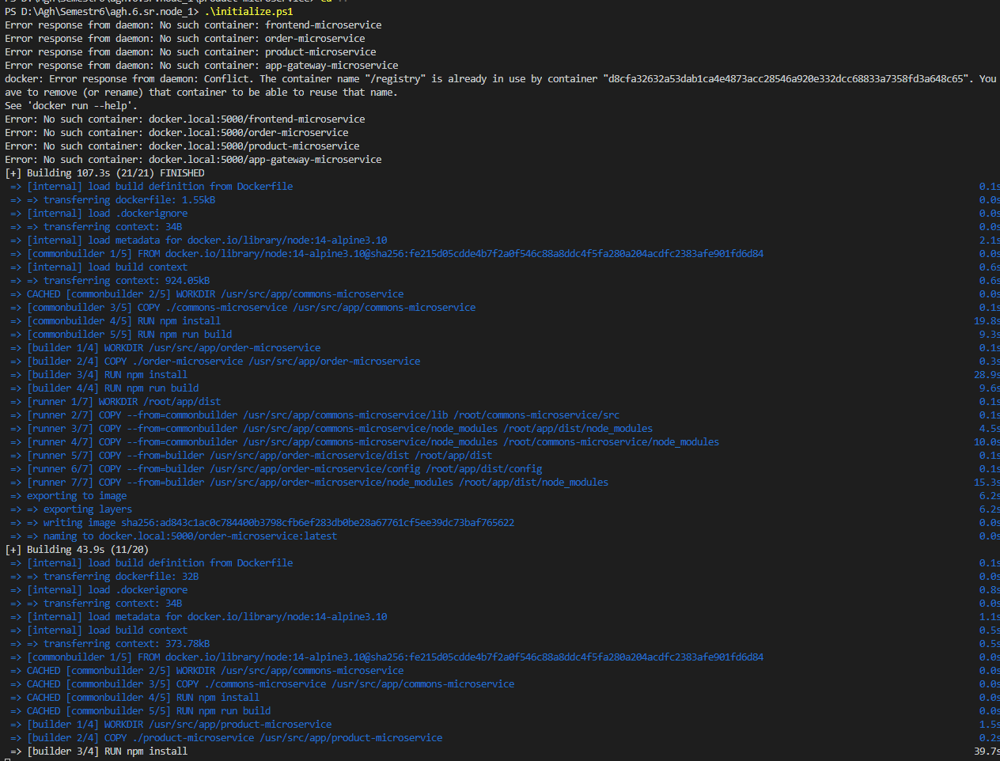
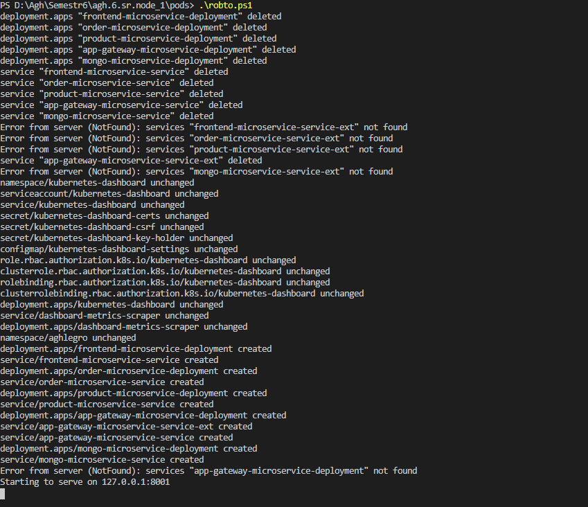
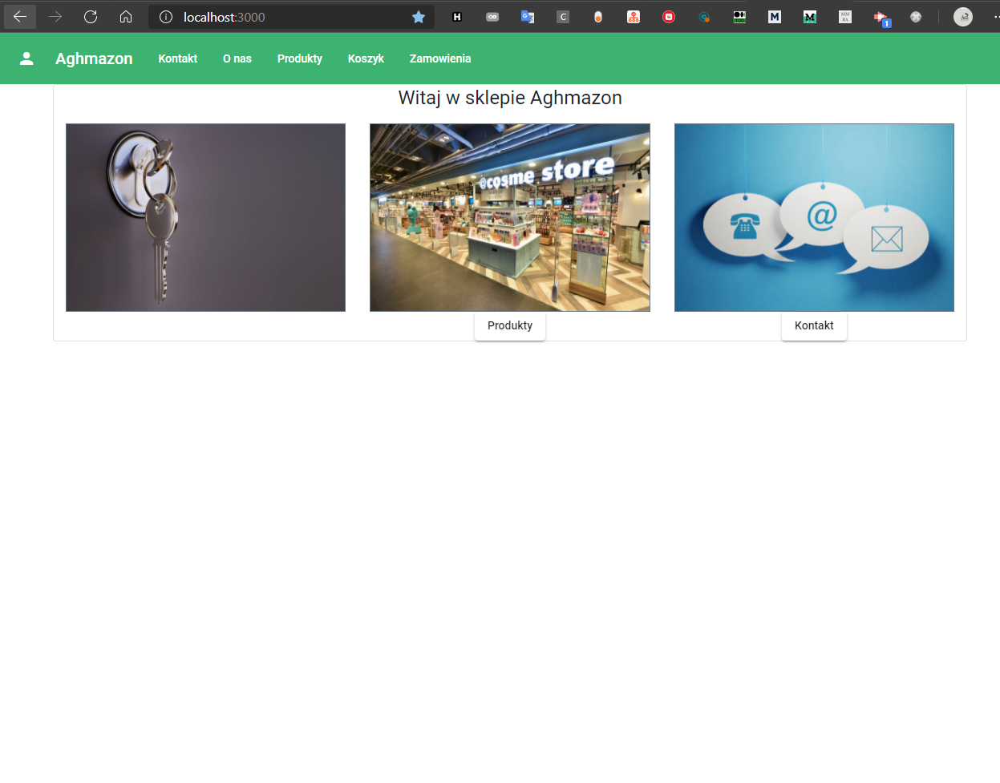
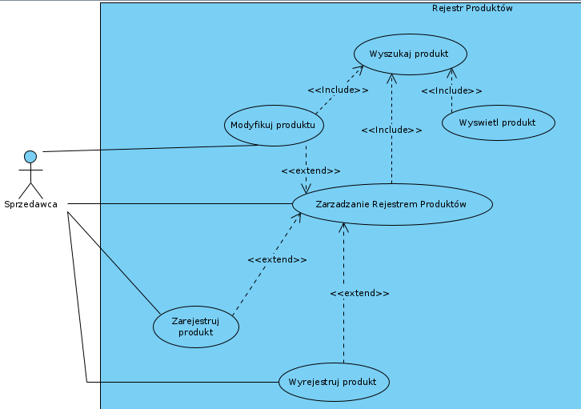
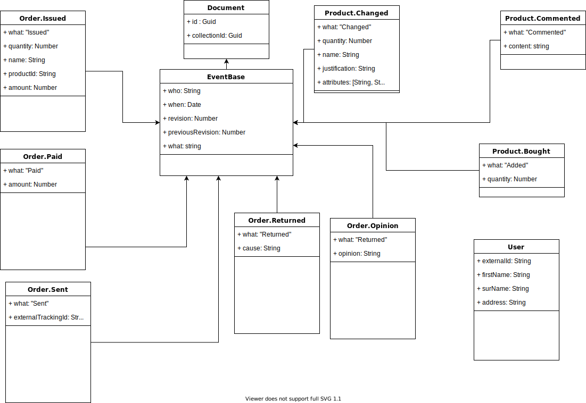
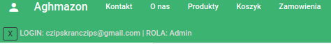
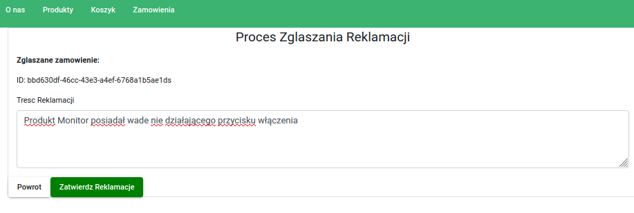

### Akademia Górniczo-Hutnicza im. Stanisława Staszica w Krakowie

Systemy Rozproszone 2020/2021


# SKLEP INTERNETOWY

autorzy: Mateusz Popielarz, Michał Flak, Kamil Gliński


## Wstęp

W tym dokumencie przedstawiamy szczegóły sklepu internetowego, opartego na Event Sourcingu i mikroserwisach.

## Opis uruchomienia

Uruchomienie było testowane tylko na windows.

1. WSL 2 [Instrukcja](https://docs.microsoft.com/en-us/windows/wsl/install-win10)
2. Docker for windows [Instrukcja](https://docs.docker.com/docker-for-windows/install/)
3. Kubernetess [Instrukcja](https://docs.docker.com/docker-for-windows/#kubernetes)
4. Stworzenie obrazów dockerowych (wywołanie Initialize.ps1)


##### Przykładowy log z uruchomienia

5. Stworzenie serwisów kubernetesss (wywołanie pods/robto.ps1)


##### Przykładowy log z uruchamiania

6. Aplikacja jest dostępna na http://localhost:3000
   
   
   
   ## Koncepcja systemu
   
   ### Cel projektu:
   
   Wykonanie aplikacji sklepu internetowego w architekturze rozproszonej.
   
   ### Lista Wymagań:
   
   - rejestracja użytkownika
   - logowanie (autentykacja)
   - pobieranie/dodawanie/modyfikacja/usuwanie produktu (administrator)
   - promocja na dany produkt (rabat)
   - promocja na zakupy powyżej ustalonej kwoty
   - zakup produktu
   - zwrot produktu
   - oddanie produktu na gwarancję
   - wystawienie opinii
   - kontakt za pomocą formularza
   
   #### Główni aktorzy w systemie:
   
   - Administrator
   - Sprzedawca
   - Użytkownik
   
   #### Propozycja architektury:
   
   Projekt zostanie zrealizowany w architekturze rozproszonej z użyciem mikroserwisów, oraz wzorców CQRS i Event Sourcing,
   
   CQRS pozwoli nam na podzielenie logiki na dwie części: logikę zapytań oraz logikę zmieniającą stan.
   
   Event Sourcing użyjemy w celu osiągnięcia śledzenia zmieniającego się stanu aplikacji, każda operacja zmiany stanu będzie zapisywana w event_log, pozwoli to na szybki dostęp do historii zmian stanu w czasie całego cyklu życia obiektu.
   
   #### Propozycja Technologii:
   
   - NodeJS
   - Angular
   - CosmosDb z MongoAPI
   - Azure
   - Swagger-UI 
   - Docker
   
   

## Analiza wymagań

## Analiza Wymagań

**Wymagania funkcjonalne:**

### System umożliwia:

- rejestrację użytkowników
- autentykację użytkowników
- manipulacje danymi produktów
- zarządzanie promocjami
- kupno produktu oraz ewentualną reklamację po zakupie
- opublikowanie opinii o usługach sklepu
- kontakt ze sprzedawcą za pomocą formularza

**Wymagania niefunkcjonalne:**

- Stabilność systemu - SLA - Uptime - System ma byc w stanie dzialac poprawnie przez 99% czasu,
- Odporność na błędy - błędy/godzine, ktore sprawia, ze system bedzie w nieprawidlowym stanie
- Przenośność kodu - Techonologie powinny byc dobierane z mysla, o tym, ze serwer moze miec rozne architektury, metryka : Ilosc architektur procesorow zdolna do uruchomienia programu
- Czystość kodu - Cyclomatic complexity  < 11
- Jakość kodu - Zachowany proces PR, podejscie funkcyjne, metryka: ilosc plikow o > 1k loc
- Optymalizacja - sredni czas przetwarzania requestu < 1s

**Use cases:**

Rejestr zamówień:


Rejestr produktów:



Diagram architektury:


Diagramy komponentów: 


Diagramy sekwencji:


Struktura danych: 



**Planowane Testy:**
Funkcjonalne

**Przypadki testowe:**

GDY: poprawne dane autentykacji 

AKCJA: autentykacja 

REZULTAT: użytkownik zalogowany  




GDY: niepoprawne dane autentykacji 

AKCJA: autentykacja 

REZULTAT: użytkownik niezalogowany
  


GDY: użytkownik niezalogowany 

AKCJA: pobranie listy produktów 

REZULTAT: brak możliwości wyświetlenia produktów  


GDY: użytkownik zalogowany 

AKCJA: pobranie listy produktów 

REZULTAT: wyświetlenie produktów


GDY: użytkownik zalogowany, produkty w systemie 

AKCJA: dodanie produktów do koszyka 

REZULTAT: produkty w koszyku

  


GDY: użytkownik zalogowany, produkty w koszyku 

AKCJA: usunięcie produktów z koszyka 

REZULTAT: usunięcie produktów z koszyka


GDY: użytkownik zalogowany, prawidlowe dane karty bankowej 

AKCJA: zaakceptowanie płatności 

REZULTAT: zmiana statusu na 'zaakceptowano platnosc'

  


GDY: użytkownik zalogowany, nieprawidlowe dane karty bankowej 

AKCJA: zaakceptowanie płatności 

REZULTAT: brak zmiany statusu płatnosci

  


GDY: użytkownik zalogowany, prawidłowe dane karty bankowej, prawidłowe dane adresowe 

AKCJA: wprowadzenie danych 

REZULTAT: możliwość zatwierdzenia zamówienia

  


GDY: użytkownik zalogowany, nieprawidłowe dane karty bankowej, nieprawidłowe dane adresowe 

AKCJA: wprowadzenie danych 

REZULTAT: brak możliwości zatwierdzenia zamówienia


GDY: użytkownik zalogowany, zatwierdzenie zamówienia 

AKCJA: zatwierdzenie zamówienia 

REZULTAT: utworzenie zamówienia, zapłacenie, utrwalenie danych adresowych

  


GDY: użytkownik zalogowany, zamówienie w systemie 

AKCJA: reklamacja zamówienia 

REZULTAT: zamówienie w stanie 'Zareklamowany'

  


GDY: administator zalogowany, poprawne dane produktu 

AKCJA: utworzenie nowego produktu 

REZULTAT: nowy produkt w systemie

  


GDY: administator zalogowany, niepoprawne dane produktu 

AKCJA: utworzenie nowego produktu 

REZULTAT: brak możliwości utworzenia produkt w systemie


GDY: administator zalogowany, zamówienie w stanie 'Zapłacony' 

AKCJA: Wyślij 

REZULTAT: zmiana statusu na 'Wysłano'  


GDY: administator zalogowany, zamówienie w stanie innym niż 'Zapłacony' 

AKCJA: Wyślij 

REZULTAT: niemożliwość zmiany statusu


GDY: administator zalogowany, zamówienie w stanie 'Zareklamowany' 

AKCJA: Zwrot 

REZULTAT: zmiana statusu na 'Zwrócony'  


GDY: administator zalogowany, zamówienie w stanie innym niż 'Zareklamowany' 

AKCJA: Zwrot 

REZULTAT: niemożliwość zmiana statusu na 'Zwrócony'  


**Opis przeprowadzonych Testów:**
Przeprowadzone zostały testy funkcjonalne dowodzące temu że aplikacja zachowuje się prawidłowo, jak oczekiwano. 

Operacje wywoływane przez warstwę interfejsu użytkownika zmieniają stan encji na bazie danych, dane przechodzą z jednego prawidłowego stanu w drugi zgodnie z założeniami.

 Operacje zmiany stanu są odpowiednio chronione, dostęp mają do nich tylko użytkownicy, którzy przeszli prawidłowo proces autentykacji. Zastosowana walidacja pól formularza na warstwie UI, spełnia założenia - zapobiega wprowadzaniu nieprawidłowych danych.


## Opis technologii

### Autoryzacja użytkownika - Auth0

Jako, że domyślnie auth0 nie przekazuje ról dodana została `reguła` - jest to fragment kodu w auth0, który pozwala na wykonanie akcji podczas pozyskiwaniu tokenu usera na serwerach auth 0`

```javascript
function setRolesToUser(user, context, callback) {
  context.idToken['https://any-namespace/roles'] = context.authorization.roles;
  context.accessToken['https://any-namespace/roles'] = context.authorization.roles;
  callback(null, user, context);
}
```

Ta funkcja wystawia jako `https://any-namespace/roles` role dodane w interfejsie Auth0 - są one kopiowane do tokena.


##### Panel z rolami


##### Wybór ról do dodania

### Router do requestów - Application Gateway

Gdy mamy aplikację mikroserwisową w celu zmiejszenia poziomu zależności użyty został API Gateway pattern - polega on na ukryciu faktu, że tak na prawdę zamiast do jednego serwisu robimy zapytania do wielu mikroserwisów.

Z jednej strony mamy możliwość śledzenia wszystkich zapytań, które aplikacja wykonuje, z drugiej możemy podmieniać mikroserwisy, ścieżki do nich i adresy do mikroserwisów w prosty sposób, ponieważ w mikroserwisach wykorzystujemy tylko adres application gatewaya.

W tym celu napisaliśmy aplikację node z użyciem biblioteki `Express gateway`


##### Screen strony głównej projektu


##### Konfiguracja ścieżek (/app-gateway-microservice)


Pozwoliło nam to podzielić aplikację na 3 części

1. Frontendową - routowaną gdy żadna inna ścieżka nie pasuje
2. Order-Microservice - api mikroserwisu zamówień
3. Product-Microservice - api mikroserwisu produktu
4. Swagger - proxy do endpointu z dokumentacją

Osiągneliśmy dzięki temu możliwość przyszłej rozbudowy, podziału ścieżek w mikroserwisach na różne mikroserwisy bez łamania wstecznej kompatybilności


##### Request aplikacji pod adres http://localhost:3000/product został przeproxowany do product-microservice, przez co wybastrakcjonowane zostały zależności i nie musimy konfigurować CORS-a

### Warstwa intefejsu użytkownika - Angular

Angular jest wszechstronnym narzędziem do tworzenia i kontrolowania widoków stron aplikacji na warstwie frontend  
Pozwala miedzy innymi na:

- komunikacje miedzy komponentami
- wsparcie dla wykonywania wywołań asynchronicznych
- wstrzykiwanie zależności reużywalnych serwisów
- obsługe ciasteczek(cookies)
- routing
- stylowanie (kompatybilny z bootstrap)

Świetnie współpracuje z jezykiem skryptowym Typescript, który jest rozszerzeniem jezyka Javascript 

### Warstwa łącząca mikroserwisy - swagger

Jako, że rest-api nie posiada żadnego standardowego mechanizmu dokumentacji endpointów zastosowaliśmy

- swagger
- swagger-ui
- tsoa - biblioteka do typescript pozwalająca na generowanie pliku swaggera z kontrolerów
- openapi-generator-cli - narzędzie pozwalające generować klienta do api, żeby nie musieć pisać ich ręcznie

Które pozwoliły nam uporościć komunikację pomiędzy poszczególnymi mikroserwisami a także debugowanie i developowanie aplikacji


###### Swagger-ui pozwala na testowanie aplikacji poprzez udostępnienie UI dla metod restowych, które jest generowane na podstawie kodu aplikacji


###### Konfiguracja swaggera znajdującego się w `commons-microservice` dołączanego do każdego z naszych mikroserwisów node - pozwala to wszystkim mikroserwisom łatwo udostępnić swagger-ui

### Narzędzie do rekompilacji - nodemon

Domyślnie node nie ma narzędzi do wspomagania procesu developementu - po zmianie kodu należy zrestartować proces Node, co jest uciążliwe i prowadzi do błędów.

W naszym projekcie użyliśmy nodemon do 

- Przeładowania aplikacji gdy pliki src się zmienią
- Uruchomienie `tsoa` które generuje pliki `swagger` i automatyczną konfiguracje routów w Express.js
- Uruchomienie `openapi-generator-cli` generującego klienta do api po każdej zmianie, aby były zawsze aktualne


##### Przykładowa konfiguracja nodemon odpowiadająca powyższemu pipeline


##### NodeMon automatycznie nasłuchujący na zmianę plików żródłowych i przeładujący aplikację


### Docker

Docker jest standardem w konteneryzacji. Szczególnie gra dużą rolę w systemach rozproszonych, gdy musimy zamiast przewidywania wszystkich możliwych błędów skupić się na tym, żeby aplikacja mogła jak najszybciej i możliwe bezpiecznie przywrócić się do działania.

Aby takie podejście bylo możliwe nasza aplikacja musi być samowystarczalna - do tego służy docker - jego idea "Environment as a code" obiecuje nam, że będziemy w stanie odtworzyć naszą aplikację bez czasochłonnej konfiguracji sprzętu.

W naszej aplikacji mamy główny dockerfile zajmujący się budową wszystkich mikroserwisów, poprzez zbudowanie 'commonsów' a później aplikacji, ustawienie wspólnych zmiennych środowiskowych i wreszcie odpaleniem aplikacji serwerowej w jednolity sposób.

To podejście pozwoliło nam łatwo skonteneryzować wszystkie mikroserwisy back-endowe


##### Dockerfile dla BE


Jako, że na front-end mamy angulara nie mogliśmy użyć tego samego pliku, więc dla niego przygotowany został osobny


##### Dockerfile dla Angulara


### Kubernetes

Jest to narzędzie do orkiestrowania kontenerami, wykorzystujemy je do aplikacji topologii naszych serwisów - dzięki kubernetesowi mamy `Infrastructure as a code` - co jest poziomem wyżej nad ideą `environment as a code`. Dzięki temu możemy w kodzie zdefiniować 

- namespace (jest to prefix, który pomaga nam uporządkować logicznie komponenty)
- deploymenty (jest to pewien komponent grupujący)
- serwisy (abstrakcja nad grupą podów)
- zbiory replik (dostarczają narzędzia do pracy na replikach)
- pody (pojedyńcze instancje kontenerów)


##### Drzewo katalogu z konfiguracją kubernetsesa


##### Przykładowy kod deploymentu seriwisu zamówień

### Kubernetesss Dashboard

W naszych skryptach obecny jest także KubernetessDashboard - jest to aplikacja, która pozwala na łatwe zarządzanie klastrem przez gui WWW.

Aby uzyskać do niego dostęp na hoście musimy pobrać token


##### Pobieranie tokena na hoście


##### Ekran przedstawiający naszą aplikację, dostępne deploymenty, użyte obrazy i pody


##### Dzięki przystępnemu UI możemy skalować aplikację w locie

### Mongo

Mongo jest noSql bazą danych. Użyliśmy jej bo jest darmowa, dobrze komponuje się z Kubernetessem i pozwala na horyzontalne skalowanie. Biorąc pod uwagę konstrukcję naszej aplikacji (event sourcing / event log), jest to dla nas idealny wybór.

Mongo jest częścią naszej konfiguracji Deploymentów w kubernetesie, przez co jest tworzone razem z całą aplikacją po uruchomieniu skryptów.


##### Nasza konfiguracja mongo dla Kubernetessa

Do połączenia z naszą apką używamy mongose, który jest ODM (Object Domain Modeling library) i pozwala na łatwe korzystanie z obiektow JS oraz walidację ich


##### Strona główna projektu mongoose


##### Nasza konfiguracja połączenia


##### Przykładowa konfiguracja walidacji

### Application Insights

Jest to narzędzie stworzone przez microsoft do instrumentacji aplikacji. 
Używamy go do zbierania logów, monitorowania stanu aplikacji oraz błędów


##### Mapa aplikacji wygenerowana na podstawie zapytań http


##### Dashboard App-Insights przedstawiające sumaryzacje błędów, czasu odpowiedzi i żądań do serwisów


##### Dashboard przedstawiający błędy w aplikacji


##### Dashboard przedstawiający najmniej wydajne zapytania


##### Dashboard przedstawiający łańcuchy zależności (nie pojedyńcze zapytania), ktore wykonują się najdłużej


##### Dashboard przedstawiający logi w aplikacji

Jak widzimy, jest to kompleksowe narzędzie pozwalające na dogłębne monitorowanie aplikacji.

Konfiguracja jest jednak banalna.

W naszym bazowym mikroserwisie mamy kod konfiguracyjny


##### Kod konfiguracyjny BE

W angularze AI jest zainicjowane jako moduł


##### Inicjalizacja w angularze


## Instrukcja Użytkownika

**Rola Użytkownik:**  

  
Ekran główny,  
Z ekranu głównego możemy przejść na strony takie jak: Zaloguj, O nas, Kontakt, Produkty, Zamówienia

  
Autentykacja,  
W celu autentykacji klikamy na ikonę osoby w prawym górnym rogu następnie logujemy się (za pomocą Oauth) wprowadzając dane użytkownika 

  
Po prawidłowym zalogowaniu się, możemy otworzyć panel z informacją o użytkowniku i jego roli w systemie

  
Produkty,  
Po wejsciu na stronę produkty, widzimy wszystkie produkty, które są na magazynie wraz z detalami jak cena, nazwa  
Mozliwe akcje to: Kupno, Dodanie do koszyka, Przegląd produktu

  
Przegląd produktu,  
W celu zapoznania się z ofertą, dokładnym opisem oraz zdjęciem produktu należy kliknąć 'Przegląd' 

  
Koszyk,  
Funkcjonalność koszyka zapewnia nam możliwość kupienia wielu produktów w jednym zamówieniu.

  
Proces Kupna Produktu,  
Na etapie kupna produktu wybieramy rodzaj wysyłki, adres kupującego oraz jesteśmy zobligowani do podania numerów karty bankowej, następnie akcpetujemy daną tranzakcje

  
Po prawidłowym zwalidowaniu danych karty bankowej, status zmienia się na 'Zaakceptowano płatność', przycisk 'Zatwierdź zamówienie' zostaje odblokowany, po jego naciśnięciu tranzakcja kupna produktów zostaje sfinalizowana - dokonujemy płatności, dane adresowe zostają utrwalone w systemie

  
Zamówienia
W sekcji zamówienia mamy dane o swoich dotychczasowych realizacjach zamówień, każdy produkt możemy dodatkowo przeglądnąć, mamy również możliwość zareklamowania zamówienia

  
Reklamacja,  
W sekcji reklamacja mamy możliwość zareklamować zamówienie wpisując przyczyne reklamacji

**Rola Administrator:**

  
Zarządzanie Produktami,  
W tej sekcji, mamy możliwość dodania nowego produktu do systemu

  
Zarządzanie Zamówieniami,  
W tej sekcji, mamy możliwość wysłania lub przyjecia reklamacji konkretnego zamówienia

## Zakończenie

Tworzenie sklepu dało nam spore doświadczenie na temat pracy zespołowej, zarządzania projektem oraz wiedzy na temat problemów i korzyści ze stosowania architektury mikroserwisowej.